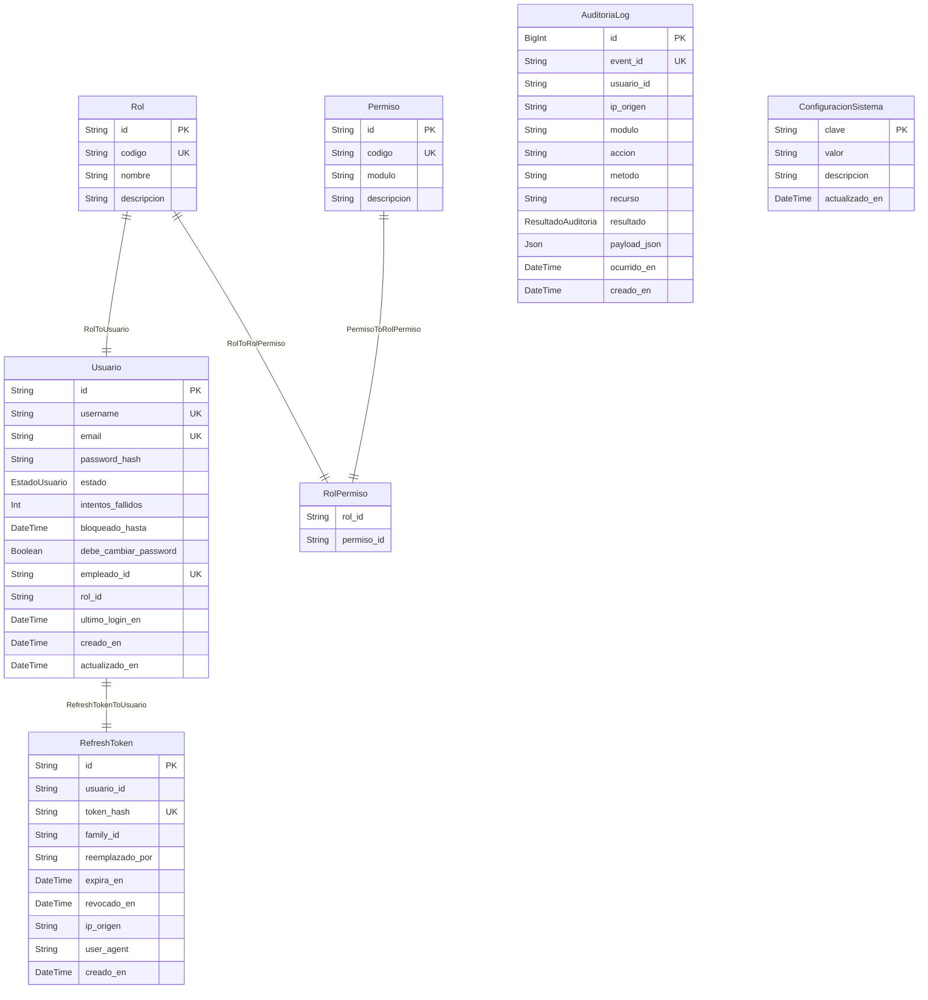

# Modelo entidad-relación — db_auth

Generado desde el DMMF del cliente Prisma.

```mermaid
erDiagram
  Usuario {
    String id PK
    String username UK
    String email UK
    String password_hash
    EstadoUsuario estado
    Int intentos_fallidos
    DateTime bloqueado_hasta
    Boolean debe_cambiar_password
    String empleado_id UK
    String rol_id
    DateTime ultimo_login_en
    DateTime creado_en
    DateTime actualizado_en
  }
  Rol {
    String id PK
    String codigo UK
    String nombre
    String descripcion
  }
  Permiso {
    String id PK
    String codigo UK
    String modulo
    String descripcion
  }
  RolPermiso {
    String rol_id
    String permiso_id
  }
  RefreshToken {
    String id PK
    String usuario_id
    String token_hash UK
    String family_id
    String reemplazado_por
    DateTime expira_en
    DateTime revocado_en
    String ip_origen
    String user_agent
    DateTime creado_en
  }
  AuditoriaLog {
    BigInt id PK
    String event_id UK
    String usuario_id
    String ip_origen
    String modulo
    String accion
    String metodo
    String recurso
    ResultadoAuditoria resultado
    Json payload_json
    DateTime ocurrido_en
    DateTime creado_en
  }
  ConfiguracionSistema {
    String clave PK
    String valor
    String descripcion
    DateTime actualizado_en
  }
  Rol ||--|| Usuario : "RolToUsuario"
  Rol ||--|| RolPermiso : "RolToRolPermiso"
  Permiso ||--|| RolPermiso : "PermisoToRolPermiso"
  Usuario ||--|| RefreshToken : "RefreshTokenToUsuario"
```
