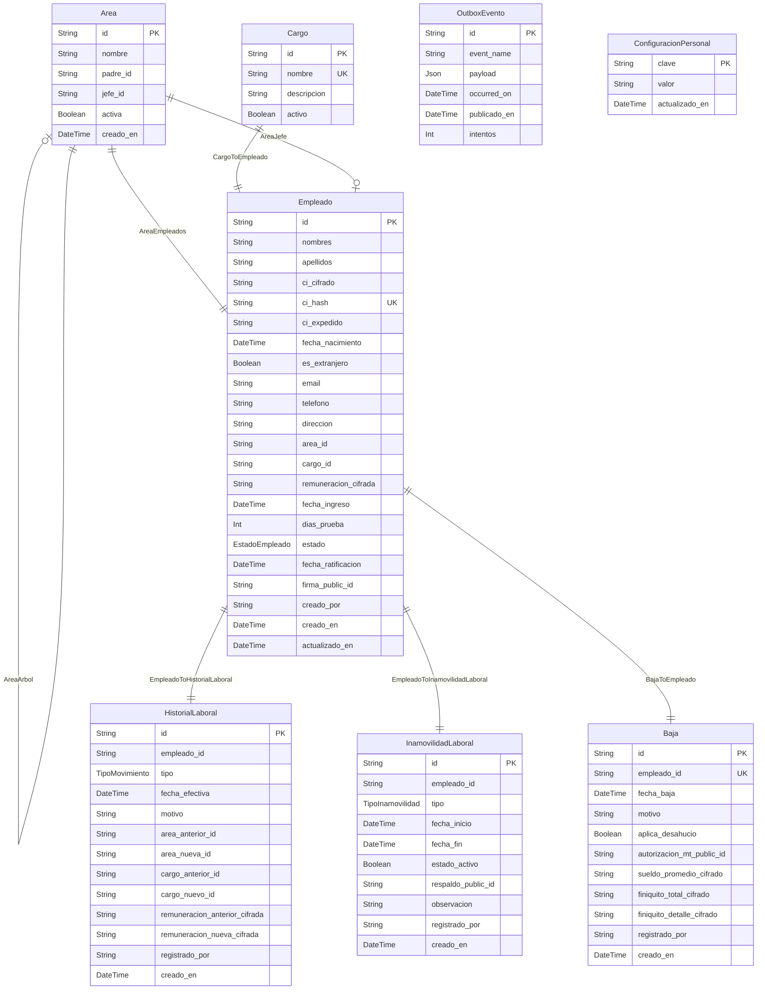

# Modelo entidad-relación — db_personal

Generado desde el DMMF del cliente Prisma.

```mermaid
erDiagram
  Area {
    String id PK
    String nombre
    String padre_id
    String jefe_id
    Boolean activa
    DateTime creado_en
  }
  Cargo {
    String id PK
    String nombre UK
    String descripcion
    Boolean activo
  }
  Empleado {
    String id PK
    String nombres
    String apellidos
    String ci_cifrado
    String ci_hash UK
    String ci_expedido
    DateTime fecha_nacimiento
    Boolean es_extranjero
    String email
    String telefono
    String direccion
    String area_id
    String cargo_id
    String remuneracion_cifrada
    DateTime fecha_ingreso
    Int dias_prueba
    EstadoEmpleado estado
    DateTime fecha_ratificacion
    String firma_public_id
    String creado_por
    DateTime creado_en
    DateTime actualizado_en
  }
  HistorialLaboral {
    String id PK
    String empleado_id
    TipoMovimiento tipo
    DateTime fecha_efectiva
    String motivo
    String area_anterior_id
    String area_nueva_id
    String cargo_anterior_id
    String cargo_nuevo_id
    String remuneracion_anterior_cifrada
    String remuneracion_nueva_cifrada
    String registrado_por
    DateTime creado_en
  }
  InamovilidadLaboral {
    String id PK
    String empleado_id
    TipoInamovilidad tipo
    DateTime fecha_inicio
    DateTime fecha_fin
    Boolean estado_activo
    String respaldo_public_id
    String observacion
    String registrado_por
    DateTime creado_en
  }
  Baja {
    String id PK
    String empleado_id UK
    DateTime fecha_baja
    String motivo
    Boolean aplica_desahucio
    String autorizacion_mt_public_id
    String sueldo_promedio_cifrado
    String finiquito_total_cifrado
    String finiquito_detalle_cifrado
    String registrado_por
    DateTime creado_en
  }
  OutboxEvento {
    String id PK
    String event_name
    Json payload
    DateTime occurred_on
    DateTime publicado_en
    Int intentos
  }
  ConfiguracionPersonal {
    String clave PK
    String valor
    DateTime actualizado_en
  }
  Area o|--|| Area : "AreaArbol"
  Empleado o|--|| Area : "AreaJefe"
  Area ||--|| Empleado : "AreaEmpleados"
  Cargo ||--|| Empleado : "CargoToEmpleado"
  Empleado ||--|| HistorialLaboral : "EmpleadoToHistorialLaboral"
  Empleado ||--|| InamovilidadLaboral : "EmpleadoToInamovilidadLaboral"
  Empleado ||--|| Baja : "BajaToEmpleado"
  %% UNIQUE area(nombre, padreId)
```
