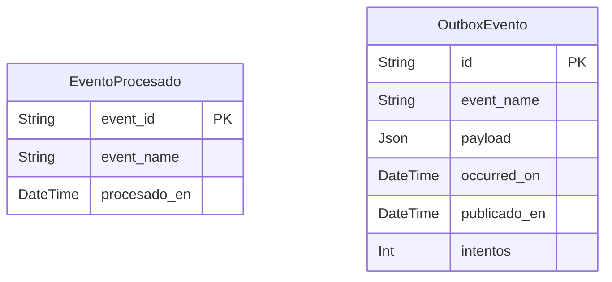

# Modelo entidad-relación — db_planillas

Generado desde el DMMF del cliente Prisma.

```mermaid
erDiagram
  EventoProcesado {
    String event_id PK
    String event_name
    DateTime procesado_en
  }
  OutboxEvento {
    String id PK
    String event_name
    Json payload
    DateTime occurred_on
    DateTime publicado_en
    Int intentos
  }
```
