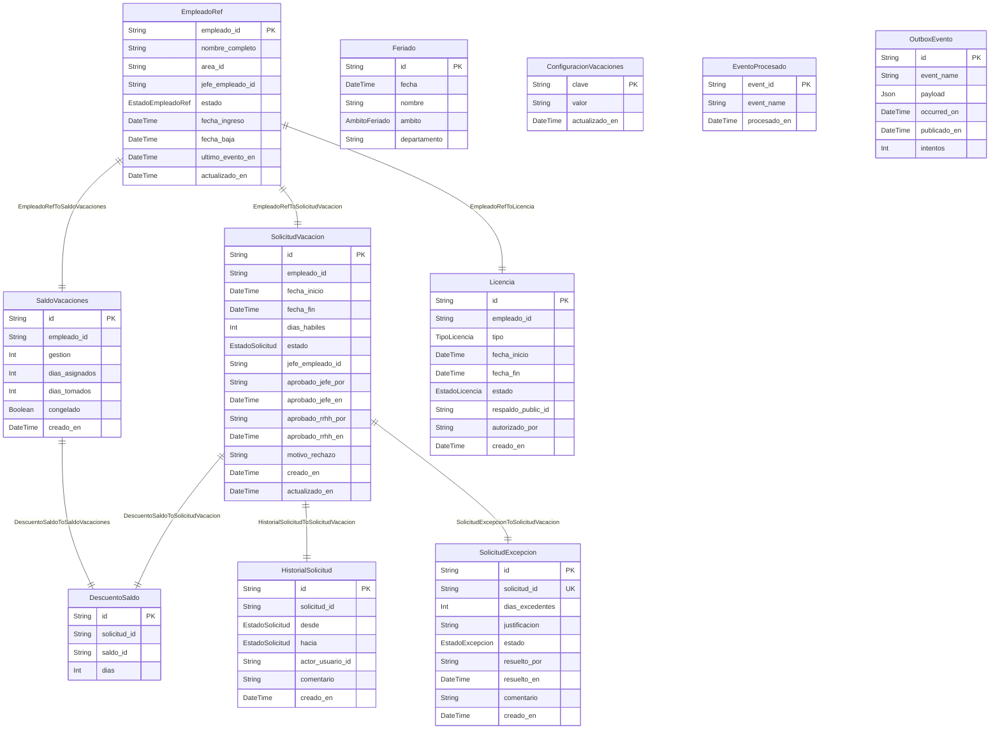

# Modelo entidad-relación — db_vacaciones

Generado desde el DMMF del cliente Prisma.

```mermaid
erDiagram
  EmpleadoRef {
    String empleado_id PK
    String nombre_completo
    String area_id
    String jefe_empleado_id
    EstadoEmpleadoRef estado
    DateTime fecha_ingreso
    DateTime fecha_baja
    DateTime ultimo_evento_en
    DateTime actualizado_en
  }
  SaldoVacaciones {
    String id PK
    String empleado_id
    Int gestion
    Int dias_asignados
    Int dias_tomados
    Boolean congelado
    DateTime creado_en
  }
  SolicitudVacacion {
    String id PK
    String empleado_id
    DateTime fecha_inicio
    DateTime fecha_fin
    Int dias_habiles
    EstadoSolicitud estado
    String jefe_empleado_id
    String aprobado_jefe_por
    DateTime aprobado_jefe_en
    String aprobado_rrhh_por
    DateTime aprobado_rrhh_en
    String motivo_rechazo
    DateTime creado_en
    DateTime actualizado_en
  }
  DescuentoSaldo {
    String id PK
    String solicitud_id
    String saldo_id
    Int dias
  }
  HistorialSolicitud {
    String id PK
    String solicitud_id
    EstadoSolicitud desde
    EstadoSolicitud hacia
    String actor_usuario_id
    String comentario
    DateTime creado_en
  }
  SolicitudExcepcion {
    String id PK
    String solicitud_id UK
    Int dias_excedentes
    String justificacion
    EstadoExcepcion estado
    String resuelto_por
    DateTime resuelto_en
    String comentario
    DateTime creado_en
  }
  Licencia {
    String id PK
    String empleado_id
    TipoLicencia tipo
    DateTime fecha_inicio
    DateTime fecha_fin
    EstadoLicencia estado
    String respaldo_public_id
    String autorizado_por
    DateTime creado_en
  }
  Feriado {
    String id PK
    DateTime fecha
    String nombre
    AmbitoFeriado ambito
    String departamento
  }
  ConfiguracionVacaciones {
    String clave PK
    String valor
    DateTime actualizado_en
  }
  EventoProcesado {
    String event_id PK
    String event_name
    DateTime procesado_en
  }
  OutboxEvento {
    String id PK
    String event_name
    Json payload
    DateTime occurred_on
    DateTime publicado_en
    Int intentos
  }
  EmpleadoRef ||--|| SaldoVacaciones : "EmpleadoRefToSaldoVacaciones"
  EmpleadoRef ||--|| SolicitudVacacion : "EmpleadoRefToSolicitudVacacion"
  SolicitudVacacion ||--|| DescuentoSaldo : "DescuentoSaldoToSolicitudVacacion"
  SaldoVacaciones ||--|| DescuentoSaldo : "DescuentoSaldoToSaldoVacaciones"
  SolicitudVacacion ||--|| HistorialSolicitud : "HistorialSolicitudToSolicitudVacacion"
  SolicitudVacacion ||--|| SolicitudExcepcion : "SolicitudExcepcionToSolicitudVacacion"
  EmpleadoRef ||--|| Licencia : "EmpleadoRefToLicencia"
  %% UNIQUE saldo_vacaciones(empleadoId, gestion)
  %% UNIQUE feriado(fecha, ambito, departamento)
```
